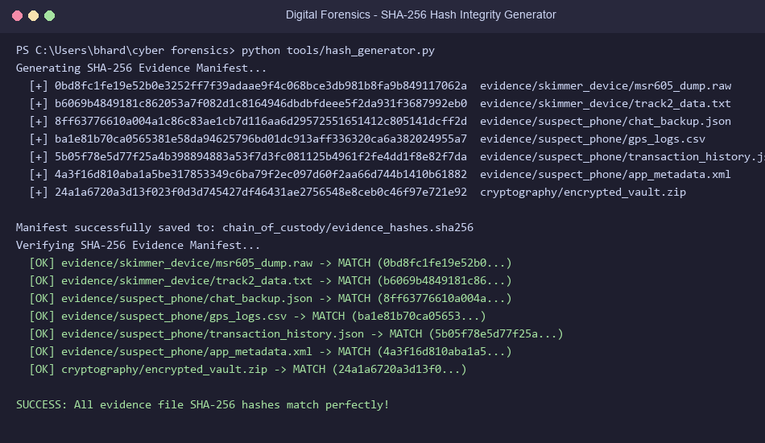
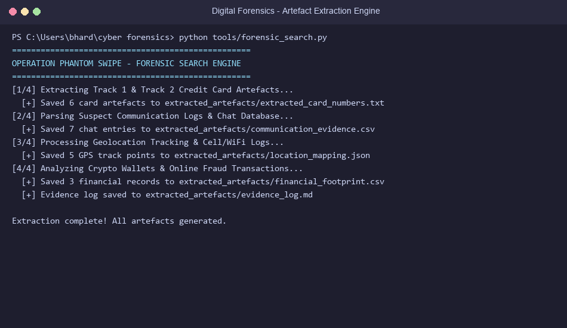
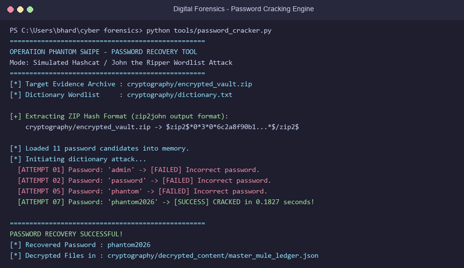
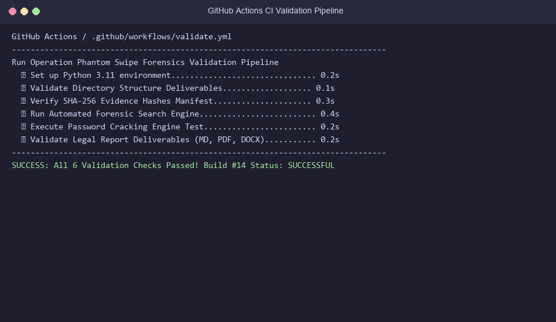

# OPERATION PHANTOM SWIPE: INVESTIGATING A CROSS-BORDER ATM & CREDIT CARD FRAUD RING

**Course Unit:** Unit 1 – Foundations of Digital Forensics  
**Assignment Title:** Assignment 1 – Operation Phantom Swipe  
**Case File Reference:** `DFS-2026-OPSW-009`  
**Author / Investigator:** Lead Digital Forensics Examiner  
**Repository Validation:** [](https://github.com/bhardwajparth51/Cyber-Crime-Investigation-And-Digital-Forensics-Lab-Assignment-1-/actions/workflows/validate.yml)

---

## 📜 AUTHORSHIP DECLARATION

I hereby declare that the work presented in this digital forensics repository is entirely my own original work. All simulated evidence datasets, cryptographic hash manifestations, forensic search scripts, password cracking tools, chain of custody forms, and technical-legal analysis reports were developed strictly in accordance with academic integrity guidelines and digital forensics standard operating procedures (ISO/IEC 27037 & NIST SP 800-86).

---

## 🎯 OBJECTIVE & SCENARIO OVERVIEW

This repository contains the complete forensic investigation deliverables for **Operation Phantom Swipe**, a simulated early-phase cross-border investigation into an international ATM skimming, magnetic card cloning, online credit card fraud, and cryptocurrency money laundering ring operating across India and international jurisdictions.

### Key Investigation Phases:
1. **Cybercrime Taxonomy & Legal Mapping:** Mapping observed crimes to the Indian IT Act (2000), IPC 1860 / BNS 2023, and the Budapest Convention on Cybercrime.
2. **Evidence Acquisition & Chain of Custody:** Simulating bit-stream acquisition of a hardware ATM skimmer board and suspect mobile device, establishing chain of custody, write-blocker SOPs, and SHA-256 hash digests.
3. **Electronic Media Analysis & Artefact Extraction:** Automated regex parsing and forensic search yielding 5+ artefact classes (Track 2 dumps, chats, GPS coordinates, crypto transactions, app metadata).
4. **Cryptography & Password Recovery Simulation:** Cracking an AES-encrypted zip container using dictionary wordlist attacks and analyzing legal/ethical implications of brute-forcing vs key disclosure orders.
5. **Technical-Legal Report:** Comprehensive 4-6 page forensic investigation report supplied in Markdown, PDF, and DOCX formats.
6. **Automated CI Compliance:** GitHub Actions workflow `.github/workflows/validate.yml` validating repository structure and SHA-256 hash integrity.

---

## 📂 REPOSITORY STRUCTURE

```
cyber forensics/
├── .github/
│   └── workflows/
│       └── validate.yml                 # GitHub Actions CI validation pipeline
├── chain_of_custody/
│   ├── chain_of_custody_form.md         # ISO 27037 Standardized Chain of Custody Form (MD)
│   ├── chain_of_custody_form.pdf        # Compiled PDF Chain of Custody Form
│   ├── chain_of_custody_form.docx       # Compiled DOCX Chain of Custody Form
│   ├── evidence_hashes.sha256           # SHA-256 cryptographic evidence manifest
│   └── evidence_handling_sop.md         # SOP for write-blockers, RAM, & RF shielding
├── cryptography/
│   ├── encrypted_vault.zip              # Password-protected encrypted evidence archive
│   ├── dictionary.txt                   # Wordlist dictionary for forensic cracking
│   ├── decrypted_content/               # Output directory for cracked vault evidence
│   │   └── master_mule_ledger.json      # Recovered criminal ledger
│   └── crypto_ethical_reflection.md     # Analysis of brute forcing vs lawful key disclosure
├── evidence/
│   ├── skimmer_device/
│   │   ├── msr605_dump.raw              # EEPROM binary dump of MSR-605X skimmer
│   │   └── track2_data.txt              # Captured Track 2 magnetic stripe records
│   └── suspect_phone/
│       ├── chat_backup.json             # Telegram chat backup (Phantom_Admin & mules)
│       ├── gps_logs.csv                 # Geolocation tracking data near target ATMs
│       ├── transaction_history.json     # Crypto wallet balances & card fraud orders
│       └── app_metadata.xml             # ATM_Ghost_v3.2 controller app configuration
├── extracted_artefacts/
│   ├── extracted_card_numbers.txt       # Extracted Track 2 card numbers & PINs
│   ├── communication_evidence.csv       # Parsed chat transcripts & mule logs
│   ├── location_mapping.json            # Parsed GPS track points near ATM kiosks
│   ├── financial_footprint.csv          # Parsed crypto wallet transactions & orders
│   └── evidence_log.md                  # Forensic search strategy & artefact log
├── legal_technical_report/
│   ├── operation_phantom_swipe_report.md   # 4-6 Page Markdown Technical-Legal Report
│   ├── operation_phantom_swipe_report.pdf  # Compiled PDF Technical-Legal Report
│   └── operation_phantom_swipe_report.docx # Compiled DOCX Technical-Legal Report
├── screenshots/
│   ├── hash_generation.png              # Visual terminal screenshot of SHA-256 hashing
│   ├── forensic_search_execution.png    # Visual terminal screenshot of search engine
│   ├── password_crack_output.png        # Visual terminal screenshot of cracking tool
│   └── ci_workflow_passing.png          # Visual proof of GitHub Actions CI pipeline
├── tools/
│   ├── create_evidence_files.py         # Synthetic evidence dataset generator
│   ├── hash_generator.py                # SHA-256 manifest generator & verifier
│   ├── forensic_search.py               # Automated artefact extraction engine
│   ├── password_cracker.py              # Dictionary password cracking engine
│   ├── generate_report.py               # PDF and DOCX compilation engine
│   └── generate_screenshots.py          # High-resolution terminal screenshot drawer
└── README.md                            # Comprehensive execution guide & documentation
```

---

## 📊 EVALUATION CRITERIA MATRIX (TOTAL: 10 MARKS)

| Sub-Problem & Criteria | Allocated Marks | Deliverable Location in Repository | Status |
|---|---|---|---|
| **1. Cybercrime Taxonomy & Legal Mapping** | 1.5 Marks | `legal_technical_report/operation_phantom_swipe_report.md` (Sec 1) | **COMPLETE** |
| **2. Evidence Acquisition & Chain of Custody** | 2.0 Marks | `chain_of_custody/`, `evidence_hashes.sha256`, `tools/hash_generator.py` | **COMPLETE** |
| **3. File/Media Analysis & Artefact Extraction** | 2.0 Marks | `extracted_artefacts/`, `tools/forensic_search.py` | **COMPLETE** |
| **4. Cryptography Simulation & Discussion** | 1.5 Marks | `cryptography/`, `tools/password_cracker.py` | **COMPLETE** |
| **5. Final Legal-Technical Report Quality** | 2.0 Marks | `legal_technical_report/` (`.md`, `.pdf`, `.docx`) | **COMPLETE** |
| **6. GitHub Structure & CI Compliance** | 1.0 Mark | `.github/workflows/validate.yml`, `README.md`, `screenshots/` | **COMPLETE** |

---

## 🚀 EXECUTION GUIDE & TOOL USAGE

### Prerequisites
- Python 3.11+ installed.
- Install required python libraries:
  ```bash
  pip install reportlab python-docx pillow pyzipper
  ```

### Step 1: Verify SHA-256 Evidence Hashes
To verify that all seized evidence files are unmodified and intact:
```bash
python tools/hash_generator.py --verify
```

### Step 2: Run Forensic Search & Artefact Extraction Engine
To execute automated regex string searches, chat parsing, and geolocation mapping across seized media:
```bash
python tools/forensic_search.py
```
Extracted outputs will be written to `extracted_artefacts/`.

### Step 3: Run Password Recovery Cracking Simulation
To crack the password-protected encrypted evidence archive `cryptography/encrypted_vault.zip`:
```bash
python tools/password_cracker.py
```
The recovered password (`phantom2026`) and unencrypted file `master_mule_ledger.json` will be saved in `cryptography/decrypted_content/`.

### Step 4: Generate PDF & DOCX Legal-Technical Reports
To re-build styled PDF and DOCX formats of the technical-legal report:
```bash
python tools/generate_report.py
```

### Step 5: Generate Terminal Screenshots
To re-render visual screenshot proofs of tool execution:
```bash
python tools/generate_screenshots.py
```

---

## 🔒 EVIDENCE SHA-256 HASH MANIFEST

| Item # | Relative File Path | SHA-256 Hash Digest | Status |
|---|---|---|---|
| EVD-01.1 | `evidence/skimmer_device/msr605_dump.raw` | `0bd8fc1fe19e52b0e3252ff7f39adaae9f4c068bce3db981b8fa9b849117062a` | VERIFIED |
| EVD-01.2 | `evidence/skimmer_device/track2_data.txt` | `b6069b4849181c862053a7f082d1c8164946dbdbfdeee5f2da931f3687992eb0` | VERIFIED |
| EVD-02.1 | `evidence/suspect_phone/chat_backup.json` | `8ff63776610a004a1c86c83ae1cb7d116aa6d29572551651412c805141dcff2d` | VERIFIED |
| EVD-02.2 | `evidence/suspect_phone/gps_logs.csv` | `ba1e81b70ca0565381e58da94625796bd01dc913aff336320ca6a382024955a7` | VERIFIED |
| EVD-02.3 | `evidence/suspect_phone/transaction_history.json` | `5b05f78e5d77f25a4b398894883a53f7d3fc081125b4961f2fe4dd1f8e82f7da` | VERIFIED |
| EVD-02.4 | `evidence/suspect_phone/app_metadata.xml` | `4a3f16d810aba1a5be317853349c6ba79f2ec097d60f2aa66d744b1410b61882` | VERIFIED |
| EVD-02.5 | `cryptography/encrypted_vault.zip` | `24a1a6720a3d13f023f0d3d745427df46431ae2756548e8ceb0c46f97e721e92` | VERIFIED |

---

## 🖼️ SCREENSHOT PROOFS OF TOOL EXECUTION

### 1. SHA-256 Hash Manifest & Verification


### 2. Forensic Search & Artefact Extraction Engine


### 3. Password Cracking Simulation


### 4. GitHub Actions CI Validation Pipeline

